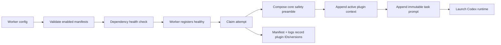

# Factory Plugin System Design

- Status: Proposed for MVP implementation
- Date: 2026-07-31
- Fork baseline: `owainlewis/factory@1af9d9c5237ffbd534bae604dd6aa8c53e969c27`
- First plugin: `dotnet-quality`

## Objective

Allow Manav's Factory fork to add specialist, versioned agent capabilities
without baking each language, framework, or review methodology into the core
worker. The first use case is a .NET quality reviewer built from a pinned subset
of `codewithmukesh/dotnet-claude-kit`.

The plugin system must support a controlled comparison between the same Factory
with no plugin and with one plugin enabled. It is an operator-managed extension
mechanism, not a public marketplace or a mechanism for repositories and issue
text to download executable code.

## Design principles

1. **Explicit activation.** A worker starts with an allowlisted set of plugin
   IDs. Repository content, prompts, issues, and agents cannot enable plugins.
2. **Pinned provenance.** Every plugin declares its own version and exact
   third-party revisions. Floating branches and implicit latest versions are
   invalid.
3. **Observable execution.** Attempt manifests, worker logs, and the resolved
   prompt identify the active plugin IDs and versions. An empty set is recorded
   for control runs.
4. **Fail closed.** Unknown manifests, missing assets, incompatible runtimes,
   missing required commands, and duplicate plugin IDs make the worker
   unhealthy before it claims tasks.
5. **No implicit hooks.** MVP plugins contribute reviewed prompt context and
   declarative dependencies only. They cannot register shell hooks, install
   packages during a task, change credentials, or run arbitrary lifecycle code.
6. **Repository neutrality.** Activating a plugin does not copy agent files,
   skills, rules, or generated configuration into the product repository.
7. **Human gates remain unchanged.** A plugin cannot authorize implementation,
   merge, self-approve, enable auto-merge, or broaden repository access.

## MVP boundary

The MVP adds bundled prompt plugins to the worker. It does not add an in-process
Go extension ABI, dynamically loaded binaries, a remote plugin registry,
marketplace installation, arbitrary scripts, UI management, or per-repository
untrusted configuration.

Each worker configuration gains:

```toml
plugin_directory = "/absolute/operator-managed/path/to/plugins"
enabled_plugins = ["dotnet-quality"]
```

The control worker sets `enabled_plugins = []`. The treatment worker sets only
`dotnet-quality`. Both point to the same immutable plugin bundle revision and
run the same Factory binary.

## Manifest contract

Each direct child directory of `plugin_directory` may contain `plugin.toml`.
Only explicitly enabled IDs are loaded. The initial schema is:

```toml
schema_version = 1
id = "dotnet-quality"
version = "0.1.0"
description = "Review-only .NET quality specialist"
runtime = "codex"
prompt_file = "prompt.md"
required_commands = ["dotnet", "cwm-roslyn-navigator"]
instruction_sets = ["code-review", "verify"]
context_files = ["codex/agents/dotnet-quality-reviewer.toml"]

[provenance]
repository = "https://github.com/codewithmukesh/dotnet-claude-kit.git"
commit = "<40-character commit>"
license = "MIT"

[[artifacts]]
kind = "nuget-tool"
name = "CWM.RoslynNavigator"
version = "0.7.0"
source = "https://www.nuget.org/packages/CWM.RoslynNavigator/0.7.0"
```

Validation rules:

- IDs and versions use a narrow ASCII grammar and bounded lengths.
- `plugin_directory` and plugin directories are real directories, not symlinks.
- `prompt_file` is a regular file below its plugin directory, never a symlink,
  and is size-bounded. Canonical-path validation prevents traversal.
- Every declared `context_file` receives the same containment and non-symlink
  validation. Deployment may install these reviewed assets into a
  runtime-specific location; Factory never copies them into a product repo.
- Required commands are basenames, not paths or shell snippets, and must exist
  on `PATH` during health checks.
- The plugin runtime must exactly match the worker runtime.
- Provenance repository, exact 40-character commit, and license are required.
- Unknown TOML fields are rejected so misspelled safety settings do not vanish.

## Runtime flow



Plugin context is clearly delimited and inserted after Factory's safety
preamble but before the task description. The core safety preamble has higher
authority. The plugin prompt is operator-trusted configuration; task and source
content remain untrusted.

Plugin order is deterministic: sort by ID before composing prompts and evidence.
The active set is frozen when the worker starts. Configuration changes require a
worker restart and never alter an already-created attempt manifest.

## First plugin: `dotnet-quality`

The first plugin contributes a review substage, not general implementation
instructions. After C#/.NET implementation and primary tests, the parent Codex
agent creates a fresh `dotnet_quality_reviewer` subagent. The reviewer uses the
pinned kit's `code-review` and `verify` methods plus relevant modern-C#,
testing, architecture, security, and convention guidance. Roslyn MCP provides
semantic evidence.

The reviewer returns `PASS`, `BLOCKED`, or `INCOMPLETE` and does not edit tracked
files or mutate GitHub. The implementation agent owns a maximum of three
fix/re-review cycles. Only `PASS` permits a normal ready-for-human-review PR;
other verdicts permit at most a draft PR with the incomplete gate disclosed.

The kit's Claude plugin, hooks, templates, auto-format-on-edit behavior, and
restore-on-edit behavior are outside the plugin. The fork consumes only the
reviewed instruction subset and Roslyn tool declared in the plugin bundle.

## Isolation limitation

The current non-nesting Proxmox LXC blocks Codex's Bubblewrap namespaces, so a
nested Codex reviewer cannot rely on the normal read-only sandbox there. During
the personal pilot, review-only behavior is prompt-enforced inside an
unprivileged LXC under a non-root account with no host mounts. Do not describe
the reviewer as an independently permissioned identity. Work portability
requires a stronger executor or separate reviewer identity.

## Compatibility and upstream sync

The plugin loader belongs at the worker prompt-composition boundary. Existing
configurations with no plugin fields behave byte-for-byte as before, except for
additional empty plugin evidence where explicitly exposed. Control-plane task,
execution, and claim schemas remain unchanged for the MVP.

This narrow boundary reduces conflict with upstream changes: core task storage,
leases, routing, worktrees, runtimes, and the web UI remain untouched. A future
per-task plugin selector would require protocol and policy work and is deferred
until matched experiments demonstrate the need.

## Acceptance criteria

- Existing worker configuration and tests pass with no plugin fields.
- An empty enabled set produces the pre-plugin prompt bytes.
- A valid enabled plugin adds one deterministic, delimited prompt section.
- Attempt manifests and logs distinguish `[]` from
  `["dotnet-quality@0.1.0"]`.
- Invalid, missing, incompatible, symlinked, traversing, oversized, or
  dependency-incomplete plugins prevent claims.
- Plugin configuration cannot execute shell, install software, or mutate a
  repository.
- The control/treatment calculator experiment can run on the same Factory fork
  commit with plugin enablement as the only Factory configuration difference.

## Deferred questions

- Per-task or phase-level plugin selection after durable phases exist.
- Separate reviewer workers and identities.
- Signed plugin bundles and checksums in addition to Git provenance.
- UI discovery and operator-controlled activation.
- Enterprise policy distribution, artifact retention, and audit export.
- Non-Codex runtimes and portable plugin capability negotiation.
